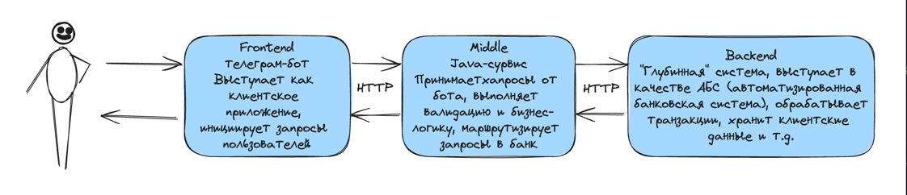
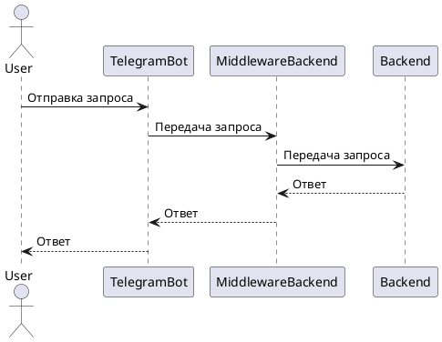
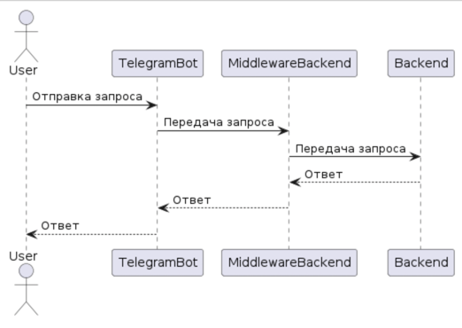

# zviagina-telegram-bot

Репозиторий для работы над учебным telegram-ботом в проекте "Мини-банк". Telegram-бот будет выступать в качестве клиентского приложения и инициировать запросы пользователей. 
Бот позволяет пользователям позволяет пользователям регистрироваться, открывать счета, проверять баланс и переводить средства другим пользователям.

## Требования

- Java 11 или выше
- Gradle 6.0 или выше

## Схема проекта



## План проекта





## Установка

1. Клонируйте репозиторий:
    ```bash
    git clone https://github.com/yourusername/zviagina-telegram-bot.git
    cd zviagina-telegram-bot
    ```

2. Добавьте в файл `application.yml` в папке `src/main/resources` имя и токен бота, полученные от [BotFather](https://core.telegram.org/bots#botfather):
    ```properties
    bot:
      name: YourBotName
      token: YourBotToken
    ```

## Запуск

1. Запустите проект с помощью Gradle:
    ```bash
    ./gradlew bootRun
    ```

   Если вы используете Windows, используйте команду:
    ```cmd
    gradlew.bat bootRun
    ```

2. Бот будет запущен и готов к использованию в Telegram.

## Использование

- `Ping` - пробная команда для получения отклика бота.
- `/register` - регистрация пользователя в мини-банке.
- `/createaccount` - открытие счета в мини-банке. Клиент получает 5000 рублей на счет при открытии.
- `/currentbalance` - получение текущего баланса пользователя.
- `/transfer [toTelegramUser] [amount]` - перевод средств другому пользователю. `toTelegramUser` - пользователь, которому переводятся средства, `amount` - сумма перевода.

## Логи

Логи приложения сохраняются в директории `/var/log/Zviagina_telegram_bot/app.log`. Вы можете настроить параметры логирования в файле `logback-spring.xml`.
