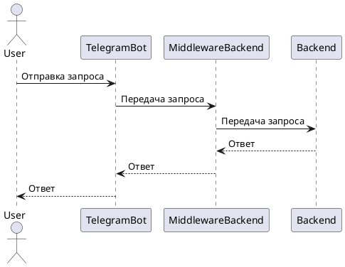
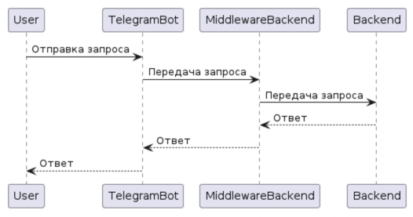

# zviagina-telegram-bot
Репозиторий для работы над учебным telegram-ботом в проекте "Мини-банк". Telegram-бот будет выступать в качестве клиентского приложения и инициировать запросы пользователей. 

## Схема проекта

## План проекта

## Запуск проекта
* Клонируйте репозиторий на локальную машину: `git clone <git@github.com:gpb-it-factory/zviagina-telegram-bot.git>`.
* Установите необходимые зависимости: `mvn install` (если используется Maven).
* Настройте файл application.properties, указав необходимые параметры подключения к базе данных и настройки бота.
* Запустите приложение: `mvn spring-boot:run`.

## Использование
* Найдите бота в Telegram по имени или используйте ссылку на [бота](здесь_однажды_будет_ссылка).
* Запустите бота и следуйте инструкциям для использования функционала "Мини-банка".